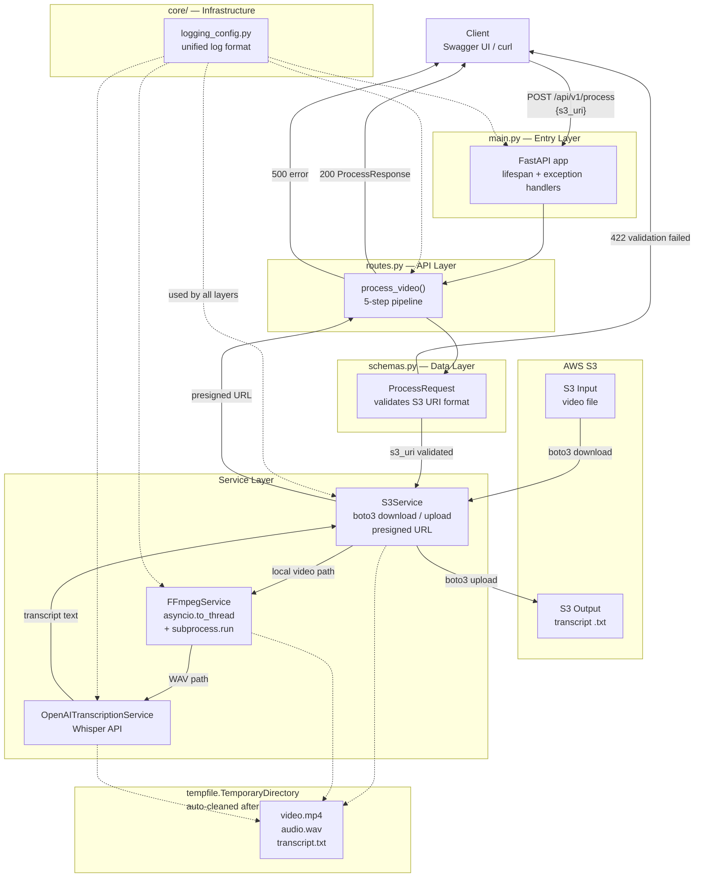

# Mini_AWS_Elemental
[](https://github.com/Oscarcheng0312/Mini_Elemental/actions/workflows/ci.yml)

An audio/video AI preprocessing microservice built to mirror AWS Elemental's microservice patterns.

Accepts an S3 URI pointing to a video file, extracts audio using FFmpeg, transcribes it via the OpenAI Whisper API, uploads the transcript back to S3, and returns a time-limited presigned download URL.

## Tech Stack

- **FastAPI** — Async web framework
- **FFmpeg** — Audio extraction
- **OpenAI Whisper** — AI speech-to-text
- **boto3 / AWS S3** — Cloud storage (input video + output transcript)
- **Pydantic v2** — Data validation
- **pytest + pytest-asyncio** — Unit testing
- **Docker** — Containerization
- **GitHub Actions** — CI/CD pipeline (auto-test + auto-push to Docker Hub on every merge to `main`)

## Project Structure

```
mini_elemental/
├── app/
│   ├── core/
│   │   └── logging_config.py   # Global logging configuration (infrastructure layer)
│   ├── models/
│   │   └── schemas.py          # Pydantic request/response models (data contract layer)
│   ├── services/
│   │   ├── s3_service.py       # AWS S3 download / upload / presigned URL (cloud layer)
│   │   ├── ffmpeg_service.py   # FFmpeg audio extraction (business logic layer)
│   │   └── ai_service.py       # AI transcription — Mock + OpenAI (business logic layer)
│   ├── api/
│   │   └── routes.py           # HTTP routes, orchestrates the 5-step pipeline (API layer)
│   └── main.py                 # Application entry point, assembles all components (entry layer)
├── tests/
│   ├── conftest.py             # Shared pytest fixtures
│   ├── test_routes.py          # API integration tests
│   ├── test_ffmpeg_service.py  # FFmpegService unit tests
│   └── test_ai_service.py      # AI Service unit tests
├── docs/
│   └── architecture.png
├── .github/
│   └── workflows/
│       └── ci.yml              # GitHub Actions: run tests → build → push to Docker Hub
├── pytest.ini
├── requirements.txt
├── Dockerfile                  # Multi-stage build (builder + runtime)
├── docker-compose.yml          # Local container orchestration
├── .dockerignore
├── .env.example                # Environment variable template (safe to commit)
└── README.md
```

## Architecture



## Data Flow

```
Client
  │  POST {"s3_uri": "s3://bucket/video.mp4"}
  ▼
Pydantic validation (valid S3 URI format?)
  │  fails → 422
  ▼
S3Service.download()          — boto3 pulls video into temp dir
  ▼
FFmpegService.extract_audio() — extracts .wav into temp dir
  ▼
OpenAITranscriptionService.transcribe() — uploads .wav to Whisper API
  ▼
S3Service.upload()            — pushes transcript.txt to S3
  ▼
S3Service.generate_presigned_url() — signs a 1-hour download link
  ▼
tempfile.TemporaryDirectory cleanup — all temp files deleted automatically
  ▼
Client receives {"presigned_url": "https://...", "transcript": "...", "expires_in": 3600}
```

## Layer Responsibilities

| Layer | File | Responsibility |
|-------|------|----------------|
| Infrastructure | `core/logging_config.py` | Unified log format, configured once at startup |
| Data Contract | `models/schemas.py` | Validates S3 URI format, defines response shape |
| Cloud Storage | `services/s3_service.py` | S3 download, upload, presigned URL via boto3 |
| Business Logic | `services/ffmpeg_service.py` | Video → WAV, no knowledge of S3 or HTTP |
| Business Logic | `services/ai_service.py` | Audio → text, Mock/OpenAI interchangeable |
| API | `api/routes.py` | Orchestrates 5-step pipeline, maps exceptions to HTTP status codes |
| Entry Point | `main.py` | Assembles the app, lifespan hooks, global exception handlers |

## Docker — Quickstart (Recommended)

The image is published to Docker Hub and includes FFmpeg and all Python dependencies pre-installed. You only need Docker and your own credentials.

### 1. Pull the image

```bash
docker pull oscarcheng77/mini-elemental:latest
```

### 2. Create a `.env` file

Copy the template and fill in your real credentials:

```bash
cp .env.example .env
```

```
OPENAI_API_KEY=sk-...
AWS_ACCESS_KEY_ID=AKIA...
AWS_SECRET_ACCESS_KEY=...
AWS_DEFAULT_REGION=us-east-1
```

> Never commit `.env` to Git — it is listed in `.gitignore`.

### 3. Run the container

```bash
docker run -p 8000:8000 --env-file .env oscarcheng77/mini-elemental:latest
```

Open `http://localhost:8000/docs` for the interactive API docs.

---

### Running locally with Docker Compose

If you cloned the repo and want to build from source:

```bash
docker compose up --build
```

---

## Setup

### 1. Install FFmpeg

Download from [https://www.gyan.dev/ffmpeg/builds/](https://www.gyan.dev/ffmpeg/builds/) and add the `bin/` folder to your system PATH.

```bash
ffmpeg -version
```

### 2. Create and Activate a Virtual Environment

```powershell
# Create the virtual environment
python -m venv .venv

# Activate it (Windows PowerShell)
.venv\Scripts\Activate.ps1
```

After activation, your terminal prompt will show `(.venv)` — this confirms the virtual environment is active and all commands will use its Python and packages.

> **Important:** Always activate the virtual environment before running the service or tests. If you skip this step, Python will use the system interpreter which does not have the project dependencies installed.

### 3. Install Python Dependencies

```powershell
pip install -r requirements.txt
```

### 4. Create an AWS S3 Bucket

1. Log in to [AWS Console](https://console.aws.amazon.com/s3)
2. Create a bucket (e.g. `mini-aws-elemental-bucket`, region `us-east-1`)
3. Keep the bucket **private** — do not enable public access

### 5. Create IAM Credentials

1. Go to **IAM → Users → Create user**
2. Attach policy: `AmazonS3FullAccess`
3. Under **Security credentials**, create an **Access Key**
4. Save the `Access Key ID` and `Secret Access Key`

### 6. Set Environment Variables

Set all four variables in the **same terminal** where you launch the server:

```powershell
# Windows PowerShell
$env:OPENAI_API_KEY      = "sk-your-openai-key"
$env:AWS_ACCESS_KEY_ID   = "AKIA..."
$env:AWS_SECRET_ACCESS_KEY = "your-secret"
$env:AWS_DEFAULT_REGION  = "us-east-1"
```

> **Security rule:** Never write credentials in code or commit them to Git. boto3 reads these environment variables automatically.

## Running the Service

Make sure the virtual environment is activated (you should see `(.venv)` in your prompt), then:

```powershell
uvicorn app.main:app --reload
```

Open the interactive API docs at:

```
http://127.0.0.1:8000/docs
```

## Usage

### 1. Upload a video to S3

Upload your video file to the S3 bucket via the AWS Console or CLI before calling the API.

### 2. Call the API

In Swagger UI, click `POST /api/v1/process` → **Try it out**:

```json
{
  "s3_uri": "s3://mini-aws-elemental-bucket/your_video.mp4"
}
```

`output_bucket` defaults to `mini-aws-elemental-bucket` and can be omitted.

### 3. Example Response

```json
{
  "status": "success",
  "presigned_url": "https://mini-aws-elemental-bucket.s3.amazonaws.com/transcripts/uuid.txt?...",
  "transcript": "Hello, this is the transcribed content of your video...",
  "expires_in": 3600
}
```

Open `presigned_url` in any browser to download the transcript. The link expires in **1 hour**.

Supported video formats: `.mp4`, `.mov`, `.avi`, `.mkv`

## Running Tests

```bash
pytest tests/ -v
```

## Switching AI Backends

To swap between Mock (instant, no API key) and real OpenAI, change two lines in `app/api/routes.py`:

```python
# Mock — for development and testing
from app.services.ai_service import MockTranscriptionService
_ai_service = MockTranscriptionService()

# OpenAI Whisper — for production
from app.services.ai_service import OpenAITranscriptionService
_ai_service = OpenAITranscriptionService()
```

Both classes expose the same `async def transcribe(self, wav_path: str) -> str` interface — swap the implementation without touching any other file.
