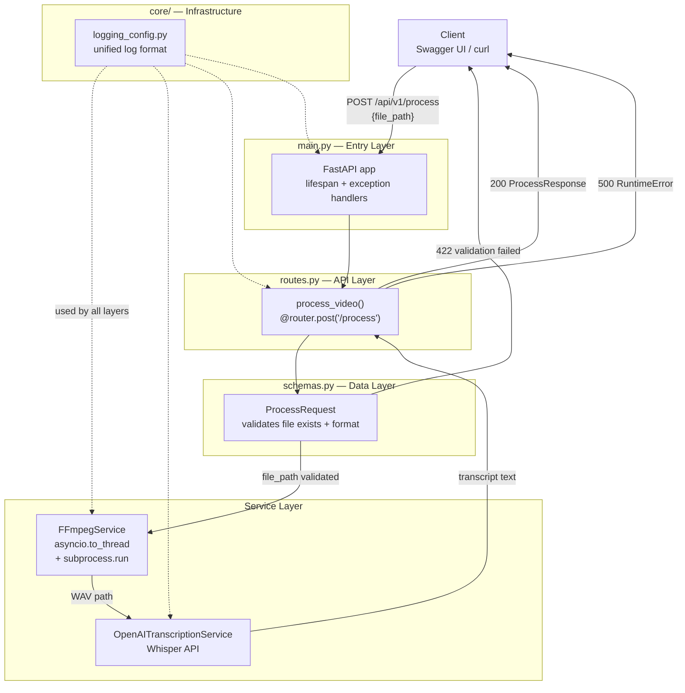

# mini_elemental

An audio/video AI preprocessing microservice built to mirror AWS Elemental's microservice patterns.

Accepts a local video file path, extracts audio using FFmpeg, and transcribes it to text via the OpenAI Whisper API.

## Tech Stack

- **FastAPI** — Async web framework
- **FFmpeg** — Audio extraction
- **OpenAI Whisper** — AI speech-to-text
- **Pydantic v2** — Data validation
- **pytest + pytest-asyncio** — Unit testing

## Project Structure

```
mini_elemental/
├── app/
│   ├── core/
│   │   └── logging_config.py   # Global logging configuration (infrastructure layer)
│   ├── models/
│   │   └── schemas.py          # Pydantic request/response models (data contract layer)
│   ├── services/
│   │   ├── ffmpeg_service.py   # FFmpeg audio extraction (business logic layer)
│   │   └── ai_service.py       # AI transcription — Mock + OpenAI (business logic layer)
│   ├── api/
│   │   └── routes.py           # HTTP routes, bridges Service layer and HTTP (API layer)
│   └── main.py                 # Application entry point, assembles all components (entry layer)
├── tests/
│   ├── conftest.py             # Shared pytest fixtures
│   ├── test_routes.py          # API integration tests
│   ├── test_ffmpeg_service.py  # FFmpegService unit tests
│   └── test_ai_service.py      # AI Service unit tests
├── pytest.ini
├── requirements.txt
└── README.md
```

## Architecture



## Layer Responsibilities

| Layer | File | Responsibility |
|-------|------|----------------|
| Infrastructure | `core/logging_config.py` | Unified log format, configured once at startup |
| Data Contract | `models/schemas.py` | Defines input/output shapes, auto-validates |
| Business Logic | `services/ffmpeg_service.py` | Video → WAV, no knowledge of HTTP |
| Business Logic | `services/ai_service.py` | Audio → text, Mock/OpenAI interchangeable |
| API | `api/routes.py` | Translates HTTP ↔ Service calls, maps exceptions to status codes |
| Entry Point | `main.py` | Assembles the app, lifespan hooks, global exception handlers |

## Setup

### 1. Install FFmpeg

Download from [https://www.gyan.dev/ffmpeg/builds/](https://www.gyan.dev/ffmpeg/builds/) and add the `bin/` folder to your system PATH.

Verify:
```bash
ffmpeg -version
```

### 2. Install Python Dependencies

```bash
pip install -r requirements.txt
```

### 3. Set OpenAI API Key

Get your API key from [https://platform.openai.com/api-keys](https://platform.openai.com/api-keys).

```powershell
# Windows PowerShell — run this in the same terminal before starting the server
$env:OPENAI_API_KEY = "sk-your-key-here"
```

> **Important:** Set the key in the same terminal window where you launch the server. Never commit API keys to Git.

## Running the Service

```bash
uvicorn app.main:app --reload
```

Once running, open the interactive API docs at:

```
http://127.0.0.1:8000/docs
```

## Usage

In Swagger UI, click `POST /api/v1/process` → **Try it out**, and provide a local video file path:

```json
{
  "file_path": "D:\\your_video.mp4"
}
```

Example successful response:

```json
{
  "status": "success",
  "wav_output_path": "D:\\your_video_audio.wav",
  "transcript": "Hello, this is the transcribed content of your video..."
}
```

Supported video formats: `.mp4`, `.mov`, `.avi`, `.mkv`

## Running Tests

```bash
pytest tests/ -v
```

## Switching AI Backends

To swap between Mock (no API key needed, instant response) and real OpenAI, change two lines in `app/api/routes.py`:

```python
# Mock — for development and testing
from app.services.ai_service import MockTranscriptionService
_ai_service = MockTranscriptionService()

# OpenAI Whisper — for production
from app.services.ai_service import OpenAITranscriptionService
_ai_service = OpenAITranscriptionService()
```

This is the **interface-oriented programming** pattern in action: both classes expose the same `async def transcribe(self, wav_path: str) -> str` interface, so the rest of the codebase requires zero changes when switching.
